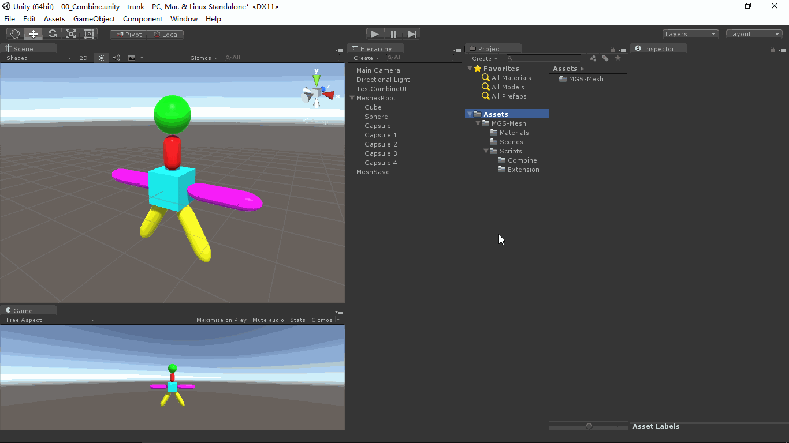

# MGS-Mesh
- [中文手册](./README_ZH.md)

## Summary
- Unity plugin for combine Meshes in scene run time.

## Environment
- Unity 5.0 or above.
- .Net Framework 3.0 or above.

## Prerequisite
- Unity provide the API(CombineMeshes method of Mesh class) to combine multi Meshes to a Mesh.

## Achieve
- MeshCombiner : Combine multi Meshes to a Mesh.

## Preview
- Combine Meshes

## Contact
- If you have any questions, feel free to contact me at mogoson@outlook.com.