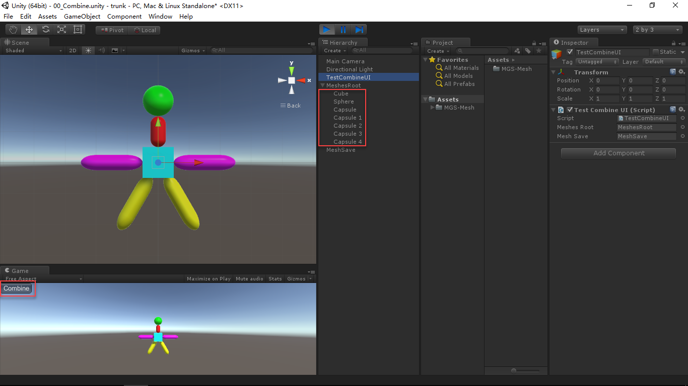
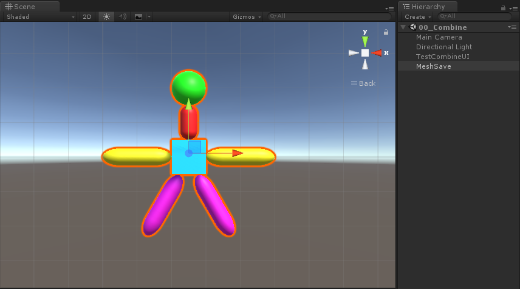

# MGS-Mesh
- [English Manual](./README.md)

## 概述
- Unity 模型网格合并。

## 需求
- 场景运行时，需要将一些零散的模型合并成一个模型网格。

## 环境
- Unity 5.0 或更高版本。
- .Net Framework 3.0 或更高版本。

## 条件
- Unity3D提供Mesh.CombineMeshes方法合并网格。

## 实现
- DMesh：合并零散模型，组建网格过滤器和网格渲染器。

## 图示
- Meshes

- CombineMesh

## 联系
- 如果你有任何问题或者建议，欢迎通过mogoson@qq.com联系我。